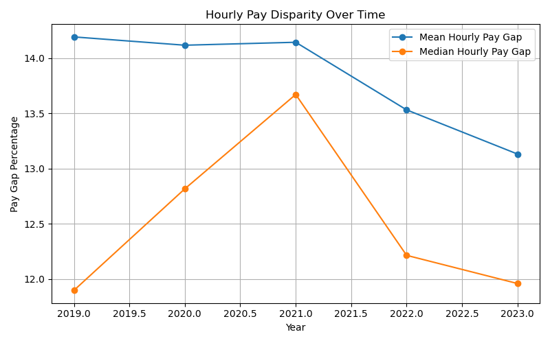
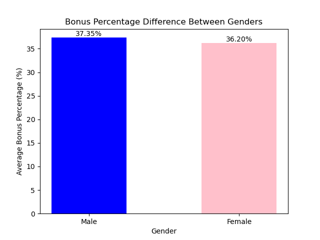
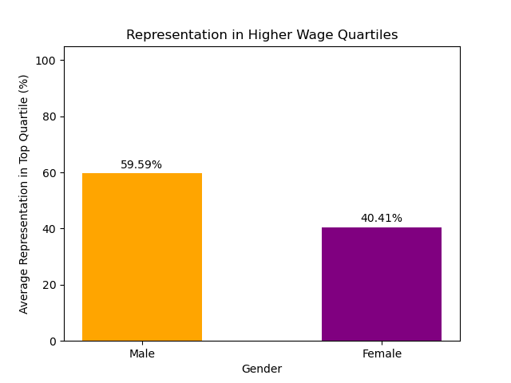
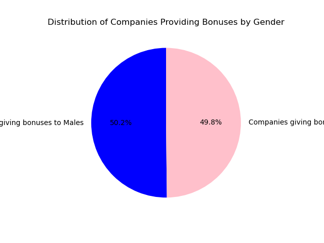
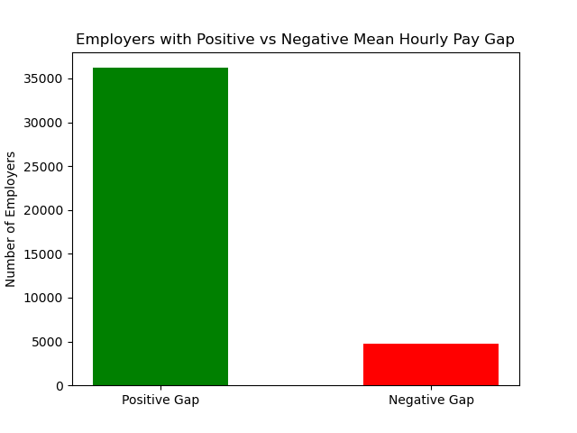

# "UK Gender Pay Gap Analysis"
Exploring wage gaps between genders in UK companies with 250+ employees from 2018-2023.

## About the Dataset: 

###  Overview

**Background:**

In the UK, big organizations (those with over 250 staff members) must share data yearly about the difference in average pay between their male and female employees. This isn't about men and women getting the same pay for the same job, which is already a legal rule. Rather, it's about understanding broader pay differences linked to roles, promotions, and experience. This information helps us spot and address deep-rooted biases and supports our push for gender fairness in workplaces.

**What's Inside:**

This collection holds information gathered by the Gender Pay Gap Service from 2018/19 to 2022/23 years. Companies share this data themselves through the Gender Pay Gap Service online platform. On this platform, people can also explore different companies' pay gap details or even compare them side by side.

**Acknowledgements**

All data has been taken from the GOV.UK Gender Pay Gap Service's downloads, available here: [(https://gender-pay-gap.service.gov.uk/viewing/download)]

## Why did I choose this dataset?

I chose this dataset because it focuses on gender pay differences, a key aspect of inclusivity and diversity. By examining these numbers, we can better understand where gaps exist and work to close them. It's important to ensure everyone is treated fairly and equally in the workplace, and this data helps highlight areas that need attention. Making informed decisions based on this data can lead to a more inclusive and diverse environment for all.

### Descriptions for each column in the dataset:

- EmployerName: Name of the employer
  
- Address: The registered address of the employer

- CompanyNumber: Unique registration number assigned to the company

- SicCodes: List of SIC codes used to describe the employer's purpose and sectors of work.

- DiffMeanHourlyPercent: Percentage difference in average hourly wages between male and female employees.
  
- DiffMedianHourlyPercent: Percentage difference in median hourly wages between male and female employees.
  
- DiffMeanBonusPercent: Percentage difference in average bonuses received by male versus female employees.
  
- DiffMedianBonusPercent: Percentage difference in median bonuses received by male versus female employees.
  
- MaleBonusPercent: Percentage of male employees that received a bonus.
  
- FemaleBonusPercent: Percentage of female employees that received a bonus.
  
- MaleLowerQuartile: Percentage of males in the lowest quartile of pay within the organization.
  
- FemaleLowerQuartile: Percentage of females in the lowest quartile of pay within the organization.
  
- MaleLowerMiddleQuartile: Percentage of males in the lower-middle quartile of pay.
  
- FemaleLowerMiddleQuartile: Percentage of females in the lower-middle quartile of pay.
  
- MaleUpperMiddleQuartile: Percentage of males in the upper-middle quartile of pay.
  
- FemaleUpperMiddleQuartile: Percentage of females in the upper-middle quartile of pay.

- MaleTopQuartile: Percentage of males in the highest quartile of pay within the organization.
  
- FemaleTopQuartile: Percentage of females in the highest quartile of pay within the organization.
  
- CompanyLinkToGPGInfo: Link to a webpage where the company provides more details or context about its gender pay gap.
  
- ResponsiblePerson: Name and designation of the individual accountable for the data's submission or its accuracy.
  
- EmployerSize: Category indicating the size of the employer (e.g., 250-499 employees, 500-999 employees, etc.).
  
- CurrentName: The present name of the company, especially if there have been name changes or rebranding.
  
- SubmittedAfterTheDeadline: Indicator (e.g., True/False) if the data was submitted after the official deadline.
  
- DueDate: The official deadline by which the data should have been submitted.
  
- DateSubmitted: The actual date on which the company submitted its gender pay gap data.
  
- EmployerId: A unique identification number assigned to each employer for tracking purposes.
  
- PostCode: Postal code associated with the employer's address.

## Project Requirements:

- Use Pandas to clean and format our dataset or datasets.
  
- Create a Jupyter notebook for cleaning and analyzing the data.
  
- Use Matplotlib to create visualizations of my dataset.
  
- Save PNG images of my visualizations to identify key trends, patterns, and insights related to inclusivity.
  
- Create a write-up summarizing my major findings. This should include a heading for each “question” that I asked my data as well as a short description of my findings and any relevant plots.

## Research Questions:

1: How have the Mean and Median Hourly Pay Gaps changed over the years, and what does the trend indicate about gender pay equity?

2: How do the average bonus percentages differ between males and females?

3: What is the average representation of male and female employees in the top wage quartile in the UK?

4: How many companies are giving bonuses to men compared to women?

5: How many companies pay men more than women and how many pay women more than men?

6: How are companies spread out based on the difference in bonus pay between men and women?

7: How do men and women compare in average representation for upper-middle level positions?

8: What are the top 10 sectors of work (based on SIC codes) where the gender hourly pay difference is the greatest?

9: How does the average bonus pay difference between genders vary across different employer sizes?

## Instructions:

**1: How have the Mean and Median Hourly Pay Gaps changed over the years, and what does the trend indicate about gender pay equity?**

- Extract the reporting year from the 'Due_Date' column.

- Group by Year and compute the mean for the required columns.

- Plot the bar chart.

- Save an image of the bar chart as a PNG file.

**2: How do the average bonus percentages differ between males and females?**

- Calculate the average bonus percentage for males and females.

- Create the bar chart.

- Annotate the bar chart with values.

- Place a text above each bar, at the center, showing its value.

- Save an image of the bar chart as a PNG file.

**3: What is the average representation of male and female employees in the top wage quartile in the UK?**

- Calculate the average representation in the top quartile.

- Plot the bar chart.

- Annotating bars with their respective values.

- Save an image of the bar chart as a PNG file.

**4: How many companies are giving bonuses to men compared to women?**

- Count the number of companies that gave bonuses to males (where Male_Bonus_Percentage is greater than 0).

- Count the number of companies that gave bonuses to females (i.e., where Female_Bonus_Percentage is greater than 0).

- Plot a pie chart with the bonus data.

- Save an image of the pie chart as a PNG file.

**5: How many companies pay men more than women and how many pay women more than men?**

- Count the number of employers where the Mean_Hourly_Pay_Gap is greater than 0, indicating men earn more on average.

-  Count the number of employers where the Mean_Hourly_Pay_Gap is less than 0, indicating women earn more on average.

-  Plot the bar chart.

-  Save an image of the bar chart as a PNG file.

**6: How are companies spread out based on the difference in bonus pay between men and women?**

- Plot a histogram to visualize the distribution of 'Median_Bonus_Pay_Gap' data.
  
- Set 'bins=50' divides the data into 50 intervals, making the distribution more detailed.
  
- 'alpha' sets the opacity of the bars (0 is transparent, 1 is opaque); 0.7 makes the bars slightly transparent.

- Save an image of the histogram chart as a PNG file.

**7: How do men and women compare in average representation for upper-middle level positions?**

- Calculate the average for 'Male_Upper_Middle_Quartile' and 'Female_Upper_Middle_Quartile' columns.

- Plot a stacked bar chart for the average representation of each gender in the upper middle quartile positions.

- Annotate the stacked bar chart with values.

- Save an image of the bar chart as a PNG file.

**8: What are the top 10 sectors of work (based on SIC codes) where the gender hourly pay difference is the greatest?**

- Group the data by 'SIC_Codes' and calculate the mean for 'Mean_Hourly_Pay_Gap' for each SIC Code.

- Define a color palette for the bars in the bar chart.

- Plot a bar chart for the top 10 SIC Codes with their associated mean hourly pay gap.

- Save an image of the bar chart as a PNG file.

**9: How does the average bonus pay difference between genders vary across different employer sizes?**

- Group the data by 'Employer_Size' and compute the mean for 'Mean_Bonus_Pay_Gap' for each employer size category.

- Create a line plot.

- Annotate each data point on the line plot with its value.

- Save an image of the line chart as a PNG file.
