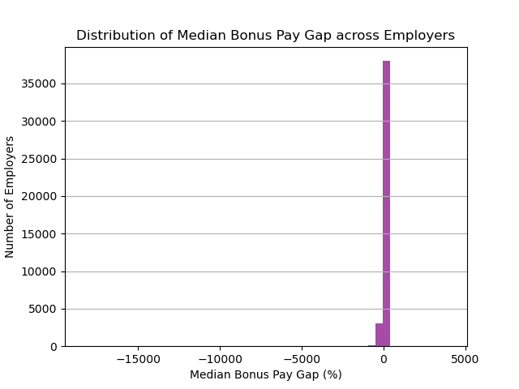
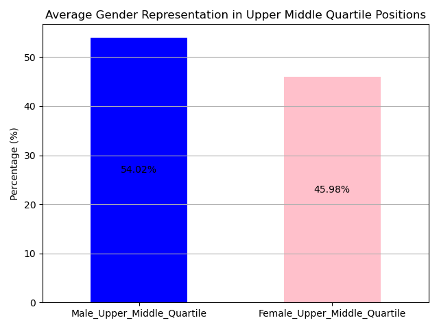
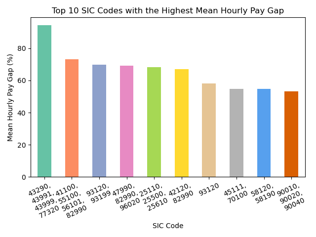
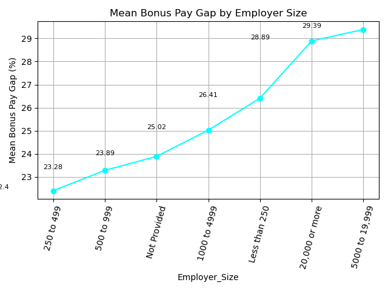

# "UK Gender Pay Gap Analysis"
Exploring wage gaps between genders in UK companies with 250+ employees from 2018-2023.

## About the Dataset: 

###  Overview

**Background:**

In the UK, big organizations (those with over 250 staff members) must share data yearly about the difference in average pay between their male and female employees. This isn't about men and women getting the same pay for the same job, which is already a legal rule. Rather, it's about understanding broader pay differences linked to roles, promotions, and experience. This information helps us spot and address deep-rooted biases and supports our push for gender fairness in workplaces.

**What's Inside:**

This collection holds information gathered by the Gender Pay Gap Service from 2018/19 to 2022/23 years. Companies share this data themselves through the Gender Pay Gap Service online platform. On this platform, people can also explore different companies' pay gap details or even compare them side by side.

**Acknowledgements**

All data has been taken from the GOV.UK Gender Pay Gap Service's downloads, available here: [(https://gender-pay-gap.service.gov.uk/viewing/download)]

## Why did I choose this dataset?

I chose this dataset because it focuses on gender pay differences, a key aspect of inclusivity and diversity. By examining these numbers, we can better understand where gaps exist and work to close them. It's important to ensure everyone is treated fairly and equally in the workplace, and this data helps highlight areas that need attention. Making informed decisions based on this data can lead to a more inclusive and diverse environment for all.

### Descriptions for each column in the dataset:

- EmployerName: Name of the employer
  
- Address: The registered address of the employer

- CompanyNumber: Unique registration number assigned to the company

- SicCodes: List of SIC codes used to describe the employer's purpose and sectors of work.

- DiffMeanHourlyPercent: Percentage difference in average hourly wages between male and female employees.
  
- DiffMedianHourlyPercent: Percentage difference in median hourly wages between male and female employees.
  
- DiffMeanBonusPercent: Percentage difference in average bonuses received by male versus female employees.
  
- DiffMedianBonusPercent: Percentage difference in median bonuses received by male versus female employees.
  
- MaleBonusPercent: Percentage of male employees that received a bonus.
  
- FemaleBonusPercent: Percentage of female employees that received a bonus.
  
- MaleLowerQuartile: Percentage of males in the lowest quartile of pay within the organization.
  
- FemaleLowerQuartile: Percentage of females in the lowest quartile of pay within the organization.
  
- MaleLowerMiddleQuartile: Percentage of males in the lower-middle quartile of pay.
  
- FemaleLowerMiddleQuartile: Percentage of females in the lower-middle quartile of pay.
  
- MaleUpperMiddleQuartile: Percentage of males in the upper-middle quartile of pay.
  
- FemaleUpperMiddleQuartile: Percentage of females in the upper-middle quartile of pay.

- MaleTopQuartile: Percentage of males in the highest quartile of pay within the organization.
  
- FemaleTopQuartile: Percentage of females in the highest quartile of pay within the organization.
  
- CompanyLinkToGPGInfo: Link to a webpage where the company provides more details or context about its gender pay gap.
  
- ResponsiblePerson: Name and designation of the individual accountable for the data's submission or its accuracy.
  
- EmployerSize: Category indicating the size of the employer (e.g., 250-499 employees, 500-999 employees, etc.).
  
- CurrentName: The present name of the company, especially if there have been name changes or rebranding.
  
- SubmittedAfterTheDeadline: Indicator (e.g., True/False) if the data was submitted after the official deadline.
  
- DueDate: The official deadline by which the data should have been submitted.
  
- DateSubmitted: The actual date on which the company submitted its gender pay gap data.
  
- EmployerId: A unique identification number assigned to each employer for tracking purposes.
  
- PostCode: Postal code associated with the employer's address.

## Project Requirements:

- Use Pandas to clean and format our dataset or datasets.
  
- Create a Jupyter notebook for cleaning and analyzing the data.
  
- Use Matplotlib to create visualizations of my dataset.
  
- Save PNG images of my visualizations to identify key trends, patterns, and insights related to inclusivity.
  
- Create a write-up summarizing my major findings. This should include a heading for each “question” that I asked my data as well as a short description of my findings and any relevant plots.

## Research Questions:

1: How have the Mean and Median Hourly Pay Gaps changed over the years, and what does the trend indicate about gender pay equity?

2: How do the average bonus percentages differ between males and females?

3: What is the average representation of male and female employees in the top wage quartile in the UK?

4: How many companies are giving bonuses to men compared to women?

5: How many companies pay men more than women and how many pay women more than men?

6: How are companies spread out based on the difference in bonus pay between men and women?

7: How do men and women compare in average representation for upper-middle level positions?

8: What are the top 10 sectors of work (based on SIC codes) where the gender hourly pay difference is the greatest?

9: How does the average bonus pay difference between genders vary across different employer sizes?

## Instructions:

**1: How have the Mean and Median Hourly Pay Gaps changed over the years, and what does the trend indicate about gender pay equity?**

- Extract the reporting year from the 'Due_Date' column.

- Group by Year and compute the mean for the required columns.

- Plot the bar chart.

- Save an image of the bar chart as a PNG file.

**Analysis:**

The graph showcases the evolution of the Mean and Median Hourly Pay Gaps from 2019 to 2023. From 2019 to 2021, the Mean Hourly Pay Gap decreased, indicating progress in addressing gender pay disparity. However, the Median Hourly Pay Gap showed a sharp increase during the same period but then saw a significant decline by 2022. By 2023, both gaps have reduced, suggesting improvements in gender pay equity. It's essential to note that while there's a decrease over time, there's still a noticeable disparity, highlighting the need for continued efforts in addressing this issue.

In simpler terms, While there's been some progress in paying men and women equally over the years, there's still a difference in their pay.

**2: How do the average bonus percentages differ between males and females?**

- Calculate the average bonus percentage for males and females.

- Create the bar chart.

- Annotate the bar chart with values.

- Place a text above each bar, at the center, showing its value.

- Save an image of the bar chart as a PNG file.

**Analysis:**

Based on the bar chart, males receive an average bonus percentage of 37.35%, while females receive an average bonus percentage of 36.20%. The difference between the bonus percentages received by males and females is about 1.15%, which is relatively small. This suggests that both genders receive nearly equivalent bonus percentages on average.

**3: What is the average representation of male and female employees in the top wage quartile in the UK?**

- Calculate the average representation in the top quartile.

- Plot the bar chart.

- Annotating bars with their respective values.

- Save an image of the bar chart as a PNG file.

**Analysis:**

By analyzing this chart, we can see a difference in the number of men and women who earn higher salaries. Specifically, a bigger percentage of men (59.59%) are in the top-paying jobs compared to women (40.41%). This shows that women might not be getting as many opportunities for higher-paying positions as men. It's essential to recognize this gap and work towards giving everyone, regardless of gender, an equal chance at these top jobs

**4: How many companies are giving bonuses to men compared to women?**

- Count the number of companies that gave bonuses to males (where Male_Bonus_Percentage is greater than 0).

- Count the number of companies that gave bonuses to females (i.e., where Female_Bonus_Percentage is greater than 0).

- Plot a pie chart with the bonus data.

- Save an image of the pie chart as a PNG file.

**Analysis:**

The pie chart provides a clear snapshot of inclusivity in bonus distribution across companies. There's a commendable near-equal split, with 50.2% of companies awarding bonuses to males and 49.8% to females. This suggests a trend toward gender balance in recognizing employee contributions. While this is an encouraging sign consistent of promoting inclusivity, it's also crucial to delve deeper and assess whether the value and size of these bonuses are equitable across genders to ensure comprehensive fairness.

**5: How many companies pay men more than women and how many pay women more than men?**

- Count the number of employers where the Mean_Hourly_Pay_Gap is greater than 0, indicating men earn more on average.

-  Count the number of employers where the Mean_Hourly_Pay_Gap is less than 0, indicating women earn more on average.

-  Plot the bar chart.

-  Save an image of the bar chart as a PNG file.

**Analysis:**

The bar chart reveals a significant disparity in hourly pay across companies. A vast majority of employers have a positive pay gap, meaning men generally earn more than women. In contrast, only a small fraction of companies have a negative pay gap, where women earn more than men. This prominent inequality underscores the need for greater efforts in promoting gender pay equity. It is essential to encourage businesses to embrace, and adopt more inclusive practices, and work diligently to overcome this pay gap. This isn't just about fairness; it's about recognizing and valuing contributions irrespective of gender.

**6: How are companies spread out based on the difference in bonus pay between men and women?**

- Plot a histogram to visualize the distribution of 'Median_Bonus_Pay_Gap' data.
  
- Set 'bins=50' divides the data into 50 intervals, making the distribution more detailed.
  
- 'alpha' sets the opacity of the bars (0 is transparent, 1 is opaque); 0.7 makes the bars slightly transparent.

- Save an image of the histogram chart as a PNG file.

**Analysis:**

The histogram shows that most companies especially those near 0% are giving men and women almost the same bonus, which is great for equal treatment. Some companies are giving women a bit more bonus than men. On the other hand, a few companies show a negative gap where the difference is quite big meaning women get much more. It's good to see many companies being fair with bonuses, but the goal should be for every company to give equal bonuses to everyone.

**7: How do men and women compare in average representation for upper-middle level positions?**

- Calculate the average for 'Male_Upper_Middle_Quartile' and 'Female_Upper_Middle_Quartile' columns.

- Plot a stacked bar chart for the average representation of each gender in the upper middle quartile positions.

- Annotate the stacked bar chart with values.

- Save an image of the bar chart as a PNG file.

**Analysis:**

The bar graph shows that in upper-middle level jobs, men are slightly ahead, holding 54% of these positions, while women hold 46%. This means there's a small gap, with men having a bit more of these jobs than women.

**8: What are the top 10 sectors of work (based on SIC codes) where the gender hourly pay difference is the greatest?**

- Group the data by 'SIC_Codes' and calculate the mean for 'Mean_Hourly_Pay_Gap' for each SIC Code.

- Define a color palette for the bars in the bar chart.

- Plot a bar chart for the top 10 SIC Codes with their associated mean hourly pay gap.

- Save an image of the bar chart as a PNG file.

**Analysis:**

This chart lists the top 10 job areas( (based on SIC codes) with big pay differences between men and women. Starting from the left, the teal bar shows the sector where men earn more than women. Across the chart, the differences in pay are substantial, indicating that in all these areas, men generally earn more than women. The goal should be achieving pay equality across all sectors, underscoring the importance of promoting inclusivity in the workplace.

**9: How does the average bonus pay difference between genders vary across different employer sizes?**

- Group the data by 'Employer_Size' and compute the mean for 'Mean_Bonus_Pay_Gap' for each employer size category.

- Create a line plot.

- Annotate each data point on the line plot with its value.

- Save an image of the line chart as a PNG file.

**Analysis:**

This graph illustrates how the bonus pay gap between genders changes as companies get larger. Starting with smaller firms of 250-499 employees, the difference in bonus pay between genders is around 23%. As companies grow in size, this gap tends to increase, peaking near 30% for companies with 5,000 to 19,999 employees. This suggests that larger companies, on average, have a more significant difference in bonus wages between men and women.

In general, the bigger the company, the larger the difference in bonus payments between male and female employees. It's essential for companies, especially larger ones, to work towards ensuring bonuses are distributed equitably. For larger organizations, it's crucial to prioritize inclusivity, ensuring that bonuses are given fairly across genders.

## Limitations:

Though this dataset and its analysis provide valuable insights into gender pay disparities in the UK, highlighting progress, still there are some limitations.

- The analyses predominantly focus on binary gender categories, potentially excluding non-binary or other gender identities.

- Trends over the years do not account for external factors that might influence the pay gap.

- The representation across sectors based on SIC codes doesn't indicate the causative factors behind the pay gaps.

- Company size in terms of employee count may not necessarily correlate with its revenue or industry influence, potentially affecting bonus distributions.

## Recommendations:

Addressing the gender pay disparities highlighted in the analysis is crucial for a more inclusive workplace. Here are some recommendations to bridge these gaps and promote equality:

**Yearly Pay Gaps:** Companies should review their pay scales yearly to ensure they're moving towards equal pay for both genders. Training programs on unconscious bias can also help.

**Bonus Differences:** Ensure that bonuses are given based on performance, not gender.

**Top-Paying Jobs:** Create mentorship and training programs specifically aimed at preparing women for leadership and top-paying roles. Encourage a diverse range of applicants for top positions.

**Company Bonuses:** Encourage companies to be transparent about bonus structures and amounts. This way, everyone knows they're getting a fair deal.

**Company Pay Rates:** Companies that have bigger pay gaps should be encouraged to attend diversity and inclusion workshops. They should also be made aware of the benefits of a diverse workforce.

**Bonus Pay Gaps:** Companies should set a goal of zero difference in bonuses between genders. They can do this by regularly reviewing and adjusting their bonus policies.

**Mid-Level Jobs:** Encourage companies to have balanced recruitment strategies. This can involve things like blind recruitment, where names or genders are hidden during initial application reviews.

**Sectors with Big Pay Gaps:** Industries with the most significant disparities should be the focus of national campaigns promoting gender equality. Sharing best practices from sectors with lower gaps can be helpful.
